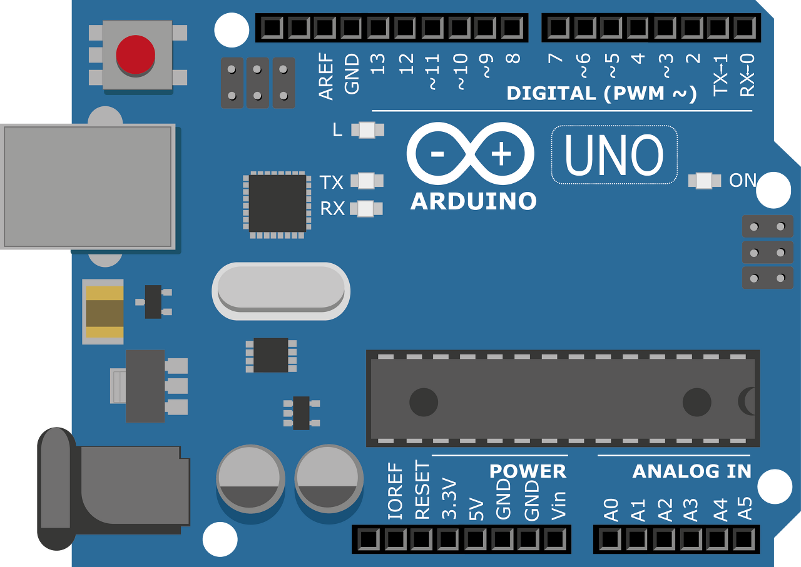

# 아두이노 실습 환경 만들기

TMP
---
> -  

|-|-|-|-|
|-|-|-|-|
|OS|WINDOW 10|-|기본 환경|
|IDE|ARDUINO IDE|[다운로드](https://www.arduino.cc/en/software)|아두이노 프로그램 개발에 사용되는 도구|
|API|CH340 DRIVER|[다운로드](https://sparks.gogo.co.nz/ch340.html)|프로그램간 통신을 위해서 사용되는 도구|

---
#
---

ARDUINO IDE 설치
---
> -  

|-|
|-|
|-|

---
#
---

CH340 DRIVER 설치
---
> -  

|-|
|-|
|-|

---
#
---

ARDUINO 종류 
---
> -  

|-|
|-|
|-|

---
#
---

ARDUINO 구성품 확인
---
> -  

|-|-|-|
|-|-|-|
| |-|-|
|-|-|-|
|-|-|-|
|-|-|-|
|-|-|-|
|-|-|-|
|-|-|-|
|-|-|-|
|-|-|-|
|-|-|-|
|-|-|-|
|-|-|-|
|-|-|-|

---
#
---

