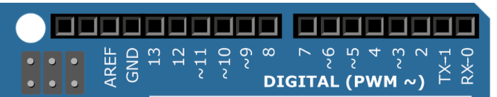
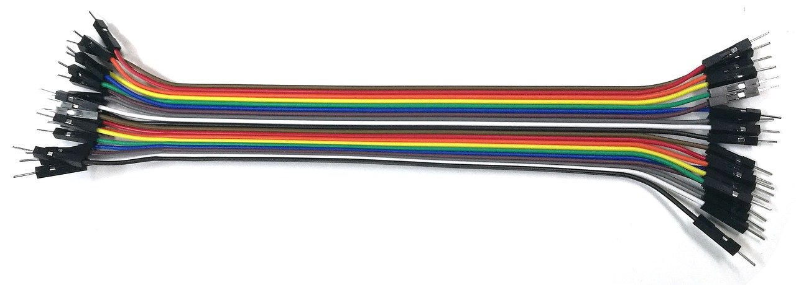

# 아두이노 실습 환경 만들기

TMP
---
> -  

|-|-|-|-|
|-|-|-|-|
|OS|WINDOW 10|-|기본 환경|
|IDE|ARDUINO IDE|[다운로드](https://www.arduino.cc/en/software)|아두이노 프로그램 개발에 사용되는 도구|
|API|CH340 DRIVER|[다운로드](https://sparks.gogo.co.nz/ch340.html)|프로그램간 통신을 위해서 사용되는 도구|

---
#
---

ARDUINO IDE 설치
---
> -  

|-|
|-|
|-|

---
#
---

CH340 DRIVER 설치
---
> -  

|-|
|-|
|-|

---
#
---

ARDUINO 종류 
---
> -  

|-|
|-|
|-|

---
#
---

ARDUINO 구성품 확인
---
> -  

|-|-|-|-|
|-|-|-|-|
|아두이노 우노| | 가장 많이 사용이 되는 아두이노로서 간편하게 처음부터 작동을 시작하고 싶을때는  그림의 왼쪽 상단 빨간 버튼(Reset)을 누르면 다시 아두이노를 시작할 수 있습니다.  PC와는 USB로 연결을 하고, PC와의 연결은 프로그램 업로드와 5V 전원 공급을 합니다.  그리고 아두이노에 기다란 핀을 꽂을 수 있는 검은색 단자가 있는데  이 부분에 부품이나 핀을 연결해 부품의 특성에 맞게 디지털이나 아날로그 2가지 방법으로 사용을 할 수 있습니다.|-|
|디지털(Digital)| |디지털 부분은 0~13번 까지 존재를 합니다. 기본적으로 0과 1번은 PC와의 연결에 사용하는 것이고,   실제로 사용가능한 단자는 2~13까지 입니다. 숫자 앞에 '~' 물결 표시가 있는 것은 전원을 켜고 끄는 것을 조절할 수 있는 부분입니다.   예를 들어서 전원을 반만 켜고 싶다면 ~표시가 있는 단자를 활용하여 사용할 수 있습니다.   그리고 GND는 GROUND의 약자로서 기준 전압을 잡는 것을 말합니다.   중학교때 땅과의 접지를 통하여 0V를 기준으로 다른 부분의 전압을 구할 수 있는 것을 알 수 있었습니다.   그와 같은 개념이라고 생각하시면 될 것 같습니다. |-|
|-| |-|-|
|-| |-|-|
|-| |-|-|
|-| |-|-|
|-| |-|-|
|-| |-|-|
|-| |-|-|
|-| |-|-|
|-| |-|-|
|-| |-|-|

---
#
---

