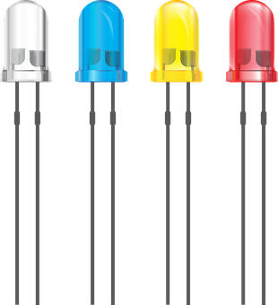

# 아두이노 실습 환경 만들기

TMP
---
> -  

|-|-|-|-|
|-|-|-|-|
|OS|WINDOW 10|-|기본 환경|
|IDE|ARDUINO IDE|[다운로드](https://www.arduino.cc/en/software)|아두이노 프로그램 개발에 사용되는 도구|
|API|CH340 DRIVER|[다운로드](https://sparks.gogo.co.nz/ch340.html)|프로그램간 통신을 위해서 사용되는 도구|

---
#
---

ARDUINO IDE 설치
---
> -  

|-|
|-|
|-|

---
#
---

CH340 DRIVER 설치
---
> -  

|-|
|-|
|-|

---
#
---

ARDUINO 종류 
---

> -  
|-|
|-|
||

> -  
|-|
|-|
|-|

> -  
|-|-|-|
|-|-|-|
|-|-|-|
|-|-|-|
|-|-|-|
|-|-|-|
|-|-|-|
|-|-|-|
|-|-|-|

---
#
---

ARDUINO 구성품 확인
---
> -  

|-|-|-|-|
|-|-|-|-|
|아두이노 우노| | 가장 많이 사용이 되는 아두이노로서 간편하게 처음부터 작동을 시작하고 싶을때는  그림의 왼쪽 상단 빨간 버튼(Reset)을 누르면 다시 아두이노를 시작할 수 있습니다.  PC와는 USB로 연결을 하고, PC와의 연결은 프로그램 업로드와 5V 전원 공급을 합니다.  그리고 아두이노에 기다란 핀을 꽂을 수 있는 검은색 단자가 있는데  이 부분에 부품이나 핀을 연결해 부품의 특성에 맞게 디지털이나 아날로그 2가지 방법으로 사용을 할 수 있습니다.|-|
|디지털 (Digital)| | 디지털 부분은 0 - 13번 까지 존재를 합니다.  기본적으로 0과 1번은 PC와의 연결에 사용하는 것이고,   실제로 사용가능한 단자는 2 - 13까지 입니다.   숫자 앞에 '~' 물결 표시가 있는 것은 전원을 켜고 끄는 것을 조절할 수 있는 부분입니다.   예를 들어서 전원을 반만 켜고 싶다면 ~표시가 있는 단자를 활용하여 사용할 수 있습니다.   그리고 GND는 GROUND의 약자로서 기준 전압을 잡는 것을 말합니다.   중학교때 땅과의 접지를 통하여 0V를 기준으로 다른 부분의 전압을 구할 수 있는 것을 알 수 있었습니다.   그와 같은 개념이라고 생각하시면 될 것 같습니다. |-|
|아날로그 (Analog)| |아날로그 부분은 A0~A5까지 있습니다. 디지털과 같이 값이 단순히 켜지거나 꺼진 경우 처럼 처리를 하는 것이 아니라 값들을 조절 할 수 있습니다. |-|
|파워 Power)| |POWER 부분은 3V3은 3.3볼트 전원, 5V는 5볼트 전원을 의미합니다.  3V3나 5V가 전원이 되고 이것은 +전극 부분에 해당합니다.  전기는 +와 -전극이 있는데 - 전극에 해당하는 것이 GND입니다. 따라서 연결에 주의하여 하지 않으면 5V같은 경우에는 PC에서 아두이노를 인식하지 못하거나 부품을 망가뜨릴 수도 있습니다.|-|
|브레드 보드(Bread Board)| |다음 그림은 브레드 보드로서 흔히 빵판이라고 불립니다. 일반적으로 전기인두를 이용해서 납땜을 해야하지만 쉽게 연결하여 값들을 쉽게 확인할 수 있도록 만들어 주는 것입니다. |-|
|점퍼선(Jumper Wires)| |점퍼선은 보통 65개의 선으로 이루어져 65점퍼선으로 불리기도 합니다. 길이가 다양하고 아두이노와 브레드보드를 연결하는데 많이 사용합니다. |-|
|듀폰 케이블 MtoF(Male to Female)| |듀폰 케이블 중에 핀을 꽂을 수 있는 경우로서  부품의 모양이 큰 경우 자주 사용되는 케이블입니다. |-|
|듀폰 케이블 MtoM(Male to Male)| |양쪽 모두 튀어나온 케이블로서 점퍼선과 동일한  기능을 하지만 선이 깔끔하고 연결이 잘 되는 장점이 있습니다. 단점이라면 가격이 약간 비쌉니다.|-|
|아두이노 우노용 케이블| |주로 아두이노 우노에 사용되는 케이블로서 'B type USB' 라고 불립니다. |-|
|LED (Light Emitting Diode)| |옆 그림은 LED로서 긴 다리가 +전극을 연결하고 짧은 다리에 -전극을 연결하면 불이 들어옵니다.  크기 모양 다리의 개수에 따라서 종류도 다양합니다.  그리고 LED는 외부 충격에 대해서 강한 내구성과 긴 수명을 가지고 있고,  낮은 전압/ 전류로 밝은 빛을 얻을 수 있습니다.  이러한 특징으로 인해서 다양한 분야에 사용이 되고 있습니다. |-|
|저항 (Resistance)| |저항은 말 그대로 전류가 흐르는 것에 대해서 저항한 다는 말로 전류를 줄여주기 위해서 사용합니다.   이전에 5V 전류를 사용하는 것은 위험하다고 말한 적이 있습니다.   그러한 경우에 저항을 사용하면 5V에 직접 연결을 하더라도 문제없이 작동을 할 수 있습니다.   일반적으로 옴(Ω) 이라는 단위를 사용하고, 사용 환경에 따라 다양한 저항을 사용합니다.|-|
|버튼 (Button)| |스위치라고 부르는 버튼은 끊어진 두 접점을 연결하는 역할을 합니다. 누르면 전류가 흘러서 어떠한 기능을 할 수 있게 되고 버튼을 떼면 다시 꺼지는 그런 기능을 합니다. 일반적으로 브레드 보드에 4개의 다리로 연결하여 작동시키기 때문에 너무 많은 사용은 지양해야 할 것 같습니다.|-|

---
#
---

