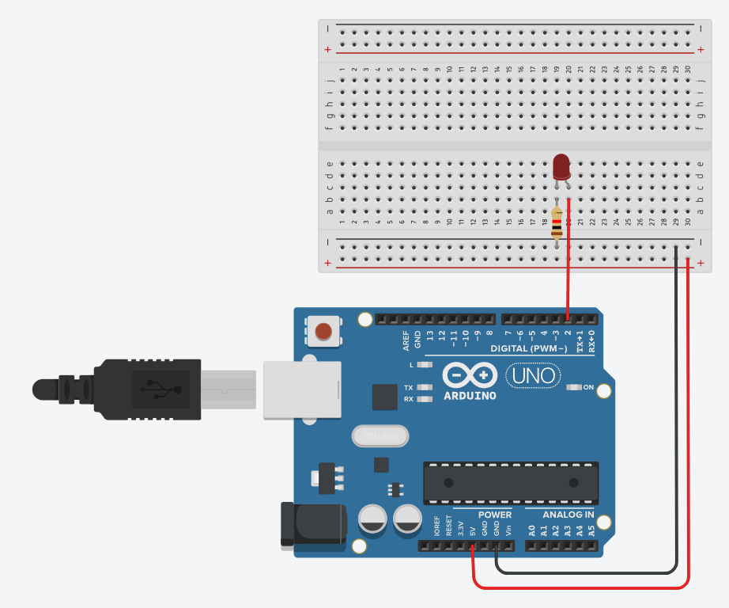
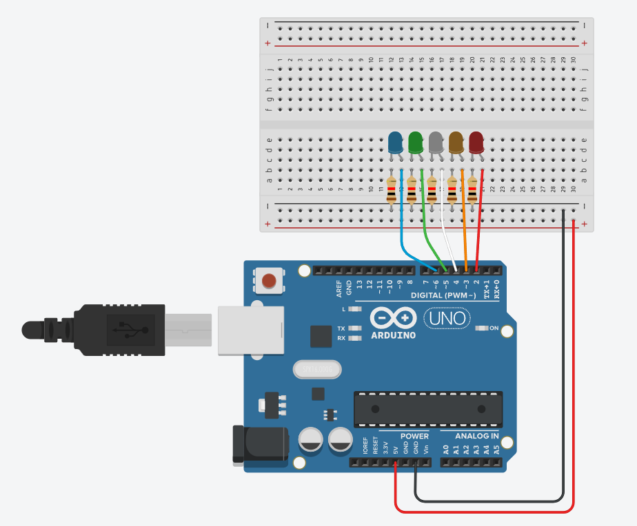

# 아두이노 우노 실습하기


사전확인
---
> EDIDTOR <br>

|-|
|-|
||
|-|

> 사용함수 정리 <br>

|-|-|-|
|-|-|-|
|-|-|-|
|-|-|-|
|-|-|-|
|-|-|-|
|-|-|-|
|-|-|-|

```
-
```

---
#
---

LED 점등실습-01
---
> 그림 <br>

|-|
|-|
|[바로가기-시뮬레이터](https://www.tinkercad.com/things/7hG3uHjqq5y-led-?sharecode=8ZboE8SFsWNvcxJhP5Elq_7MJDO3u65oWl48yYvu5yQ)|
| |

> 예제 1 <br>

```
const unsigned int pinNo = 2;

void setup()
{
   pinMode(pinNo,OUTPUT);
}

void loop()
{
	digitalWrite(pinNo, HIGH);
}
```

> 예제 2 <br>

```
const unsigned int pinNo = 2;

void setup()
{
   pinMode(pinNo,OUTPUT);
}
void loop()
{ 
  	delay(500);
	digitalWrite(pinNo, HIGH);
  	delay(500);
	digitalWrite(pinNo, LOW);
}
```

---
#
---

LED 점등실습-02
---
> [공유링크] <br>

|-|
|-|
| |
|[바로가기-시뮬레이터](https://www.tinkercad.com/things/hM41NEIwThZ-led-02?sharecode=My3keytqNlIphL6EeDeDNpol_kgyN_e6flSmUf5kj44)|

```
const unsigned int led[5] = {2,3,4,5,6};

void setup() {
  for(int x=0 ; x<5 ; x++){
    pinMode(led[x],OUTPUT);
  }
}
void loop() {
  for(int i=0;i<5;i++){  
      //ALL OFF
      for(int x=0;x<=5;x++){
        digitalWrite(led[x],LOW);
      }  
      digitalWrite(led[i], HIGH);
      delay(500);
  }
}
```

---
#
---

LED 점등실습-01
---
> - <br>

|-|
|-|
|-|
|-|

```
-
```

---
#
---

LED 점등실습-01
---
> - <br>

|-|
|-|
|-|
|-|

```
-
```

---
#
---

LED 점등실습-01
---
> - <br>

|-|
|-|
|-|
|-|

```
-
```

---
#
---

LED 점등실습-01
---
> - <br>

|-|
|-|
|-|
|-|

```
-
```

---
#
---
