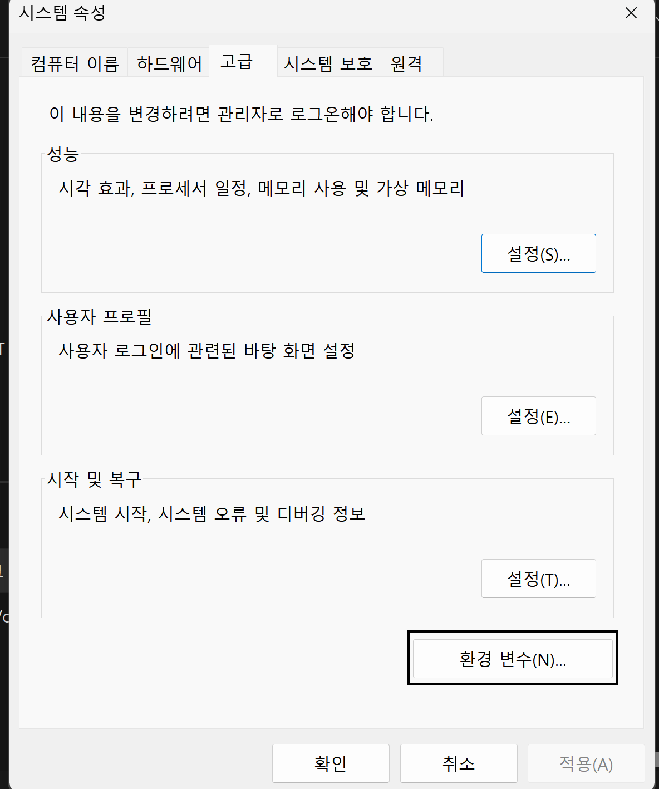

# [직원]웹서버 실습 환경 만들기

|-|-|-|
|-|-|-|
|JDK|[설치설정](https://jdk.java.net/archive/)|-|
|INTELLIJ IDE|[설치/설정](https://m.blog.naver.com/djusti/223143383341)|[DOWNLOAD](https://www.jetbrains.com/ko-kr/idea/download/?section=windows)|


강의장 기본환경
---
> OPENJDK 21 설치 <br>

|-|
|-|
||
||
||
||

> WINDOW PATH 환경변수 설정 <br>

|-|
|-|
||
||
||
||
||
||
||
||
||
||
||
||
||


> INTELLIJ COMMUNITY DOWNLOAD <br>

|-|
|-|
||
||
||
|-|


> INTELLIJ 경로 PATH 설정 <br>

> 기본 Project Download <br>

```
-
```

---
#
---

JDK 확인 
---
> TEST <br>

|-|
|-|
||

```
-
```

---
#
---

SPRINGBOOT PROJECT받기 
---
> TEST <br>

|-|
|-|
|-|

```
-
```

---
#
---

TEST
---
> TEST <br>

|-|
|-|
|-|

```
-
```

---
#
---

TEST
---
> TEST <br>

|-|
|-|
|-|

```
-
```

---
#
---

TEST
---
> TEST <br>

|-|
|-|
|-|

```
-
```

---
#
---

TEST
---
> TEST <br>

|-|
|-|
|-|

```
-
```

---
#
---
